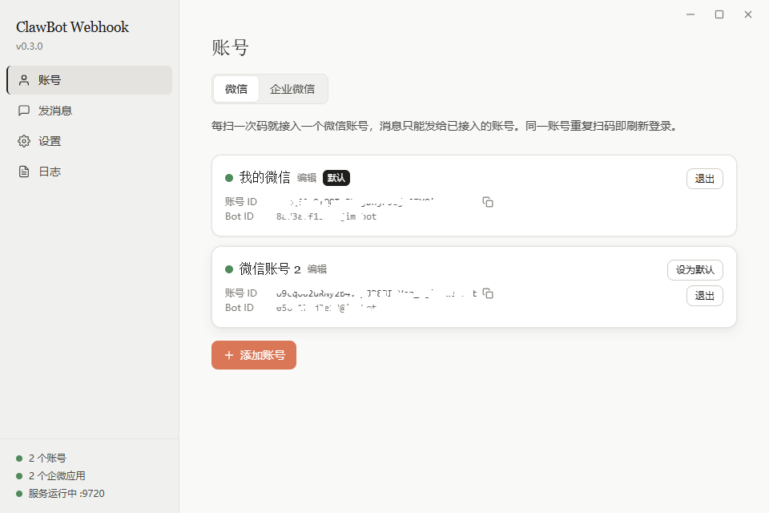

# weixin-clawbot-webhook

把微信 ClawBot（腾讯官方 iLink Bot 协议）包成一个本地 HTTP webhook：扫码登录一次，之后局域网内任何脚本 / curl / CI 一行请求就能给你的微信主动发消息。

Tauri 2 + Rust 单 exe，不依赖 Node / Python 运行环境，Windows 10/11 开箱即用。



## 这是做什么用的

给「程序 → 人」的通知场景用的。凡是你的代码想主动往微信里推一条消息，都可以用它：

- CI/CD 部署完成、测试失败时通知你
- 定时任务 / 爬虫 / 监控脚本报警（磁盘满、服务宕机、价格波动……）
- 家里的 NAS、树莓派、软路由状态播报
- 任何能发 HTTP 请求的地方——只要一行 curl

原理很简单：它在本机起了一个 HTTP 服务，你 `POST /send`，它调用微信官方的 iLink Bot API 把文本发到你扫码登录的那个微信上。

## 功能

- **多账号**：每扫一次码接入一个微信，各自独立凭据；同一账号重复扫码即刷新登录
- **企业微信**：可添加多个企业微信自建应用（corpid / agentid / secret），`POST /wecom/send` 给成员或 `@all` 推文本；access_token 自动缓存与刷新
- **本地 webhook**：默认监听 `9720` 端口，API key 鉴权，局域网内可直接调用
- **图形界面**：扫码登录、发消息测试、调用日志（最近 500 条）、端口 / API key 设置
- **单文件分发**：安装版 + 免安装 portable 版，GitHub Actions 自动构建发布

## 实现方案

- **协议**：腾讯官方 iLink Bot API（`ilinkai.weixin.qq.com`，参考官方包 `@tencent-weixin/openclaw-weixin`），非逆向。扫码 → 长轮询确认 → 拿到 `bot_token` 等凭据 → 用凭据调 `/ilink/bot/sendmessage` 发文本。
- **后端**（`src-tauri/src/`）：Rust + tokio + axum 提供 HTTP 服务；reqwest 调 iLink 接口；凭据 / 配置 / 日志以 JSON 持久化在本地。
- **前端**：Svelte 5 + SvelteKit（静态适配）+ Tailwind CSS 4，通过 Tauri command 与后端通信，负责扫码、账号管理、测试发送、日志与设置页。
- **打包**：Tauri 2 bundle（NSIS 安装包 + portable exe），推 tag 自动构建发布。

## 安装

到 [Releases](../../releases) 下载：

- `*-setup.exe`：安装版
- `*-portable.exe`：免安装单文件（Win10/11 自带 WebView2 即可运行）

未做代码签名，首次运行 SmartScreen 会提示「未知发布者」，点「更多信息 → 仍要运行」。首次启动 Windows 防火墙会询问是否允许监听，请勾选专用网络。

## 使用

1. **账号**：打开应用 → 账号页 → 获取二维码 → 用要接入的微信扫码并确认。每扫一次码接入一个账号，可接入多个；同一账号重复扫码即刷新登录。接入后请用该微信给机器人发一条任意消息（建立会话），否则微信会以 `ret=-2` 拒绝推送。
2. **收件人 = 已接入的账号，一一对应**：每个账号由它自己的机器人发给自己。实测：用 A 的机器人发给 B，微信会返回成功（message_id）但 B 永远收不到，所以接口对未接入的 `to` 直接返回 `400 unknown_recipient`。收件人 ID 是 iLink 用户 ID（形如 `o9cq8…@im.wechat`，账号页可复制），不是微信号/wxid。「发消息」页选一个账号即可给它发。
3. **企业微信（可选）**：企业微信管理后台 → 应用管理 → 创建自建应用，记下 agentid 与 secret；「我的企业」页底部记下 corpid。回到本应用 → 账号页 → 切到「企业微信」Tab → 添加应用，保存时会实时验证三项凭据。收件人必须在该应用的可见范围内。
4. **设置**：查看/复制 API key，按需改端口（默认 9720）。
5. **调用**：

```bash
curl -X POST http://<本机IP>:9720/send \
  -H "X-API-Key: <你的key>" \
  -d '{"to":"<账号ID>","text":"部署完成 ✅"}'
```

`to` 是已接入账号的 ID（账号页可复制），省略则发给默认账号；不需要 Content-Type 头。设置页会生成填好 key 和默认账号的完整命令。

也可以用 `Authorization: Bearer <key>`。

```bash
# 企业微信：app 为应用备注名（省略 = 默认应用），to 为成员 UserID（| 分隔）或 @all（省略 = @all）
curl -X POST http://<本机IP>:9720/wecom/send \
  -H "X-API-Key: <你的key>" \
  -d '{"app":"运维告警","to":"@all","text":"部署完成 ✅"}'
```

## 接口

| 方法 | 路径 | 说明 |
|---|---|---|
| `POST /send` | `{"text": "...", "to": "可选"}` | 发文本消息，需鉴权。`to` 必须是已接入账号的 ID（用该账号自己的凭据发给自己）；缺省 = 默认账号 |
| `POST /wecom/send` | `{"text": "...", "to": "可选", "app": "可选"}` | 发企业微信文本，需鉴权。`to` = 成员 UserID（`\|` 分隔）或 `@all`，缺省 `@all`；`app` = 应用备注名，缺省默认应用。成功返回 `{"ok":true,"app","to","msgid","invalid_users":[...]}`，`invalid_users` 为不在可见范围的收件人 |
| `GET /health` | — | `{"ok":true,"logged_in":bool,"accounts":n,"wecom_apps":n,"version":"..."}`，不鉴权 |

| HTTP | code | 含义 |
|---|---|---|
| 200 | — | 已发送 |
| 400 | `bad_request` | 缺 `text`、JSON 非法或 `to` 格式错误 |
| 400 | `unknown_recipient` | `to` 不是已接入账号的 ID；只能发给已扫码接入的账号 |
| 401 | `unauthorized` | API key 错误 |
| 429 | `rate_limited` | 微信侧拒绝（ret=-2）：首次给某人推送前，需对方先在微信里给机器人发过一条消息建立会话；否则是频率限制（约 7 条/5 分钟），稍后重试；企微：每应用对同一成员 30 次/分钟、1000 次/小时 |
| 503 | `not_logged_in` / `token_expired` | 未登录或登录失效，回应用重新扫码 |
| 502 | `upstream_error` | 微信服务端或网络错误，body 里有原始信息 |
| 400 | `unknown_app` | 企微：`app` 不是已添加应用的备注名 |
| 400 | `unknown_recipient` | 企微：收件人全部无效或不在应用可见范围（81013 等） |
| 503 | `not_configured` | 企微：尚未添加任何应用 |
| 503 | `invalid_credentials` | 企微：corpid / agentid / secret 无效，账号页会显示原因 |

失败响应统一为 `{"ok":false,"code":"...","error":"..."}`。

## 数据目录

`%APPDATA%\com.liuli.weixin-clawbot-webhook\`：`accounts.json`（各账号的登录凭据，明文，请勿外传；v1 的 `credentials.json` 首次启动时自动迁移）、`config.json`（端口/API key/默认账号）、`wecom_apps.json`（企微应用的 corpid / agentid / secret 与缓存的 access_token，明文）、`logs.json`（最近 500 条）。

## 开发

```bash
pnpm install
pnpm tauri dev               # 开发运行
pnpm build                   # 构建前端（cargo test 前需要）
cd src-tauri && cargo test   # 后端测试
```

发版：把 `src-tauri/tauri.conf.json` 里的 `version` 改好，打 tag `vX.Y.Z` 推上去，GitHub Actions 自动构建并发布 Release（tag 与配置文件版本不一致会直接失败）。

## 说明与限制

- 只做「主动发送」，不接收消息；只支持文本。
- 每个账号接入后，需用该微信给机器人发过一条消息激活，否则推送返回 `ret=-2`；会话可能过期，过期后再发一条即可。
- 不支持跨账号发送（A 的机器人发给 B）：微信侧返回成功但对方收不到，接口直接拒绝。
- bot_token 有效期数天到数周，失效后 `/send` 返回 503 `token_expired`，重新扫码即可。
- 协议为腾讯官方 iLink Bot API（`ilinkai.weixin.qq.com`），非逆向；协议演进可能导致失效。
- 企业微信只支持成员 UserID 与 `@all`，不支持部门 / 标签；文本超过 2048 字节由企业微信截断；部分收件人不在可见范围时仍会发给其余人，并在 `invalid_users` 里返回。
- 若企业微信后台开启了「企业可信IP」，本机公网 IP 不在名单内会返回 502 且 error 含「不安全的访问IP」；请在后台配置或关闭该功能。
